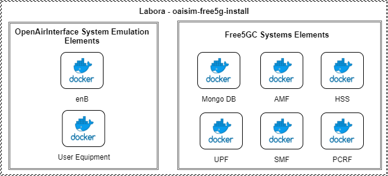
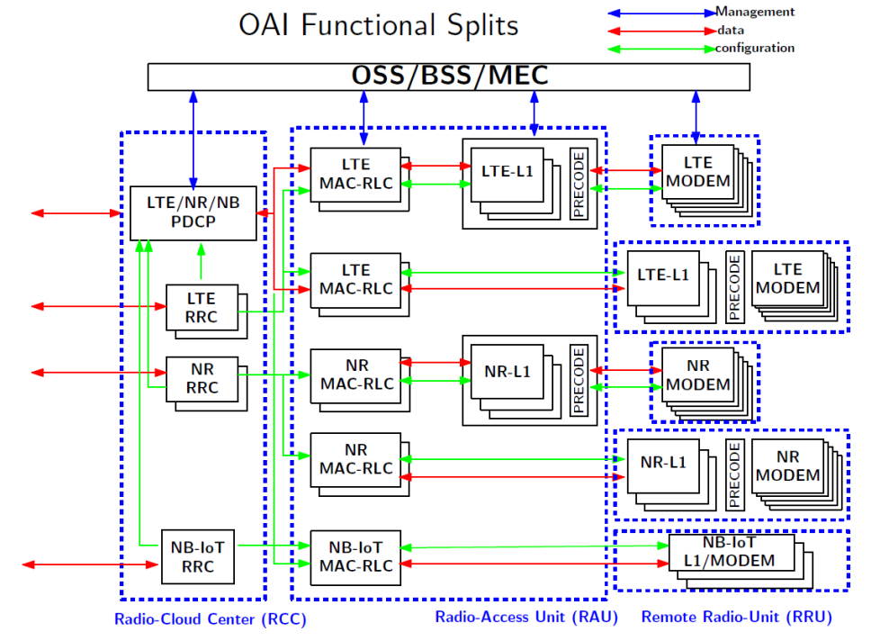
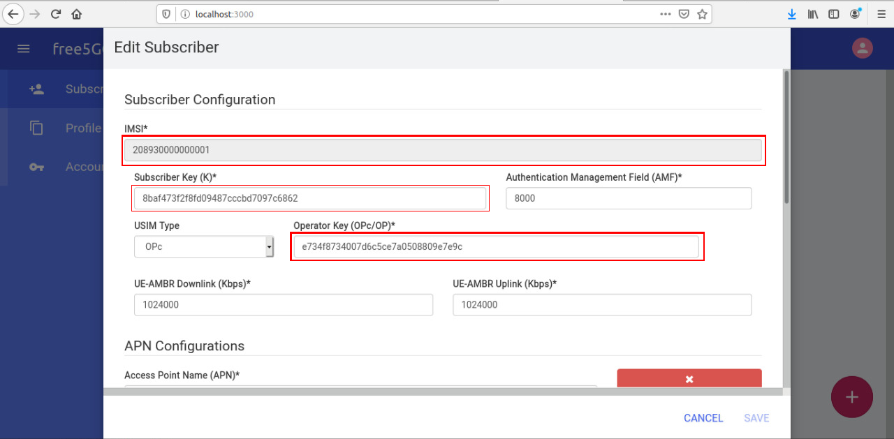

## OAISIM + free5GC with Docker.

This project is a simulation of the 5G environment of telecommunications networks. The objective of this work is to create a modular and containerized system for tests, simulations and analysis of the 5G communication network.

Therefore, this project makes use of two other major projects, Free5GCore and OpenAirInterface. In our project, the two environments communicate to generate the simulation. Everything was developed on top of the docker container platform and is orchestrated via docker compose

For more information about F5GC or OAI:
* [free5gc](https://www.free5gc.org/)
* [Open Air Interface](https://www.openairinterface.org/)

### Overview of the system structure

The image above represent the actual system and how it is disposed.

<p align="center">
     
</p>

## Project Description

In this repository, we developed an environment for simulating UE and ENB using l2NFAPI simulator from Open Air interface connected into 5g core from free5gcore. This work is on-going.

The 5G have a lot of information and metricts that are fundamental to understand the sysmtem. With that in mind, lets focous especific on the part of the system that we are adressing our problem. This repository is focousing on the eNB of OpenAirInterface.

The eNB is the hardware that is connected to the mobile phone network that communicates directly wirelessly with mobile handsets (UEs). In this case, this hardware is simulated.


The main contribution of this branch is a split on eNB. Today the eNB can be classified in three main components, that can be visualized in this figure: 


<p align="center">
     
</p>


However, this system was made to be a monolith environment, so every structure from above run in the same computer and in the same container. This functional split is made to alleviate the overload on the main eNB computer, by grouping the RCC and RAU in one container ans spliting the RRU to another. RRU also is a light part of the system that can be redundant.


At the moment, what we have is a splited eNB to run on one computer, with all the others components.
I have not tested yet if this program is running as expected in multiples machines.


## Minimum Requirement
- Software
    - OS: Ubuntu 18.04
    - Linux kernel: 4.15.0-43-generic

- Hardware recommended
    - CPU: Intel i5
    - RAM: 8GB
    - Hard drive: 50G

## Dependencies

To execute this program you need to install:

* [Docker](https://docs.docker.com/install/)
* [Docker Compose](https://docs.docker.com/compose/install/)


## Install
Each box of project is based on a compiled free5gc image. To build this image use the follow command:

``sudo docker build -t free5gc-base .``

Each box of project is based on a compiled oaisim image. To build this image use the follow command:

``cd oaisim-base``

``sudo docker build -t oaisim-base  .``


## Running
To run all boxes and Web interface use the follow command:
``sudo docker-compose up -d``

## Testing
To verify if everthing is running okay, you can firt check if **MongoDB** and **Web User Interface** is initialized. You can check this in your browser with the address ```http://<deployment-environment-IP-address>:3000```

The Web Application access port can be changed through the parameter ```web_application_access_port```, the default value is _3000_. The default access credentials of the Web Application are:

* User: **admin**
* Pass: **1423**

After login, you must add one UE to the web interface for the tunneling on the user equipment work properly. By defaul this code is only using one user equipement for thesting the conectivity. You can add the information bellow to the respective windows.

``IMSI: 208930000000001``
``Subscriber Key: 8baf473f2f8fd09487cccbd7097c6862``
``Operator Key: e734f8734007d6c5ce7a0508809e7e9c``

<p align="center">
     
</p>

# 
